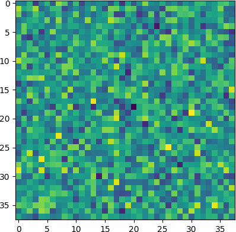
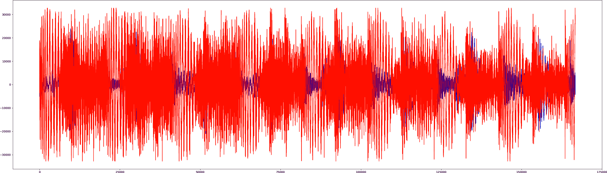

# techno
Taking a number of techno tracks, we:
* convert to wav, normalize sample rate and tempo
* **order tracks using a special correlation measurement**
* **locally align the clips using a sliding window** and finally:
* **interpolate to produce a "continuous" mix** N.b. still working to improve accuracy of the tempo normalization. Improved tempo normalization would improve xsition quality

## example usage:
```
python3 py/robo_dj.py songs
```

### Notes
*  **tested on Ubuntu and MacOS**
* files in songs/ folder are mp3 or m4a format
* **two songs from the larger collection are included in the repo, for testing**
* wav conversion, samplerate normalization, tempo normalization, and local alignment steps are performed with **local parallelism** to take advantage of multicore processors
* Some steps don't re-run if intermediary files already exist: may need to delete intermediary files if you want to reiterate after changing the input data

## result
Five hours of high-energy music for long coding, driving, sports or study sessions:
https://soundcloud.com/ashrichardson/data-science-mix

### 2023 Version
[https://music.youtube.com/watch?v=FXsyvHnT94U&list=MLPT](https://music.youtube.com/watch?v=FXsyvHnT94U&list=MLPT)

## findings
* Correlation can be used to align techno clips of same tempo for a smooth transition
* Correlation does not take bar lines or counts into account
* Can get wrong answers like being half a beat off!
* More complex method required for reliability

## matrix of correlation between the tracks


## clips aligned for correlation on 3.78s window


## files:
* **robo_dj.py**: main subroutine / entry point
* **correlation.py**: calculate correlations between tracks
* **parfor.py**: parallel for loop that runs a function in parallel on an array of inputs
* **stitch.py**: use above correlations to establish ordering, then locally align transitions and interpolate
* **work_queue.py**: process a list of system calls in parallel; one worker thread per CPU thread

## sample input files included:
* [first track](songs_out/best_progressive_2019_vol_1_01.mp3)
* [second track](songs_out/best_progressive_2019_vol_1_05.mp3)

## sample output files generated:
* [output: continuous mix](songs_out/out.mp3)
* [output: transition segment](songs_out/xsition.mp3)
