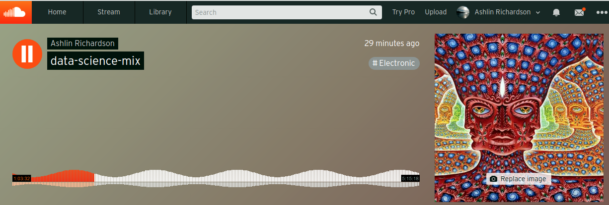
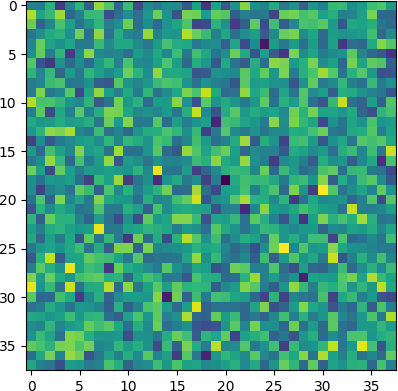

# techno
Taking a number of techno tracks, we:
* normalize them in sample rate and tempo
* order them using a special correlation measurement
* locally align the clips using a sliding window, and finally:
* interpolate to produce a "continuous" mix. N.b. still working to improve accuracy of the tempo normalization. Improved tempo normalization would improve the quality of transitions

## result
Five hours of high-energy music for long coding or study sessions:
https://soundcloud.com/ashrichardson/data-science-mix

Incidentally, it seems the track (a wav file over 3 GB) broke soundcloud's waveform visualization. Fortunately soundcloud allowed us to upload the file, alas the waveform vis generation seems to have failed since a default pattern appeared:

## matrix of correlation between the tracks

